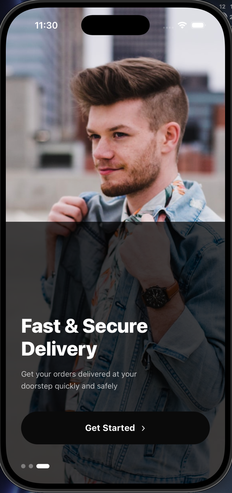
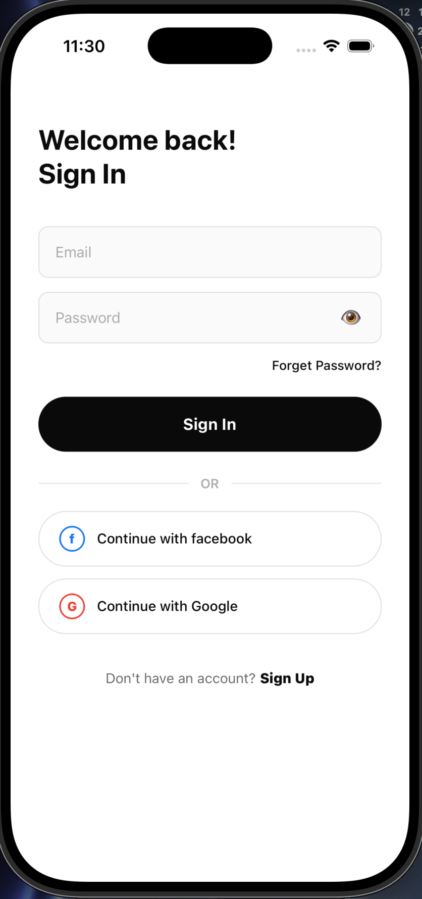
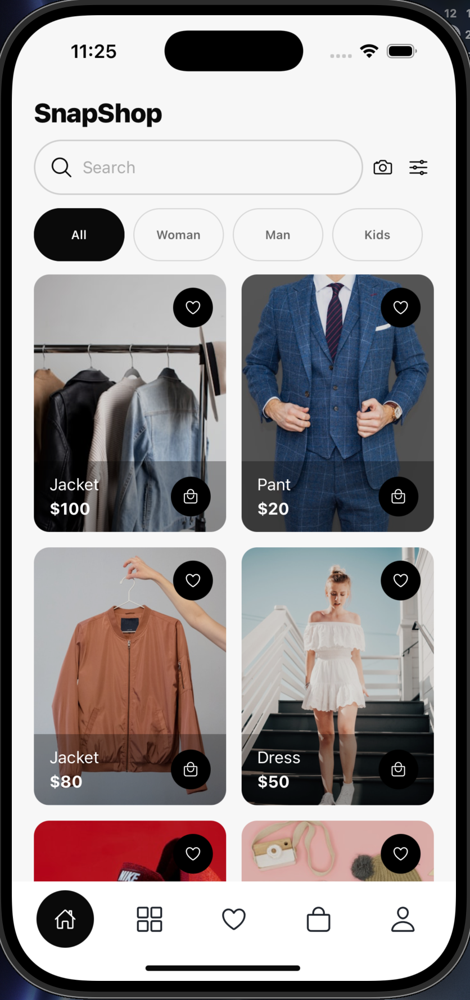
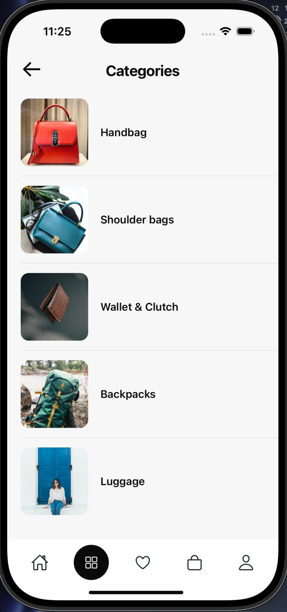
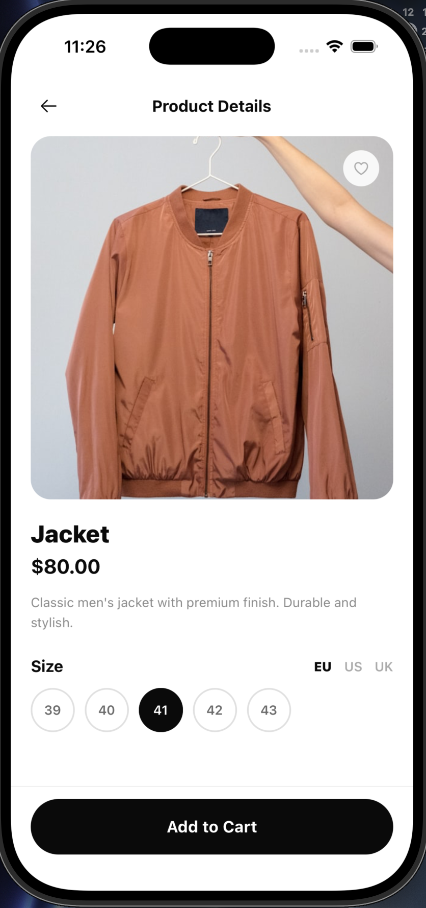
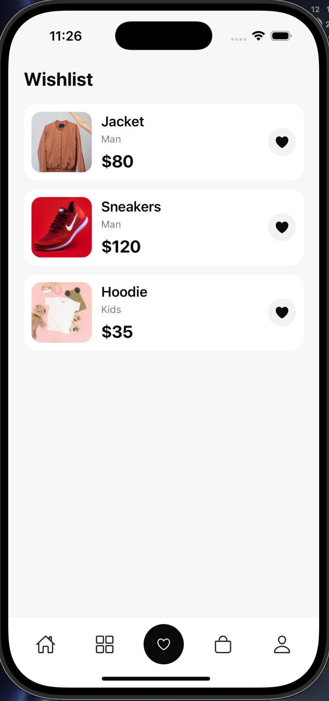
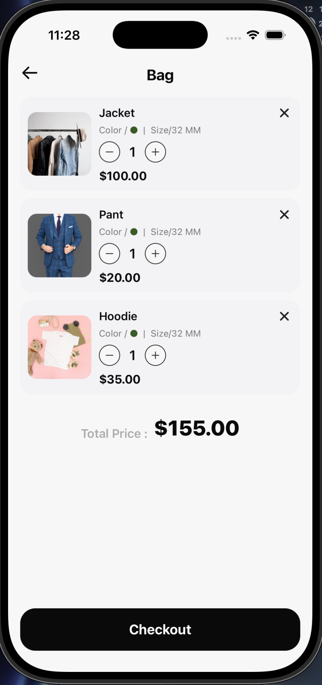
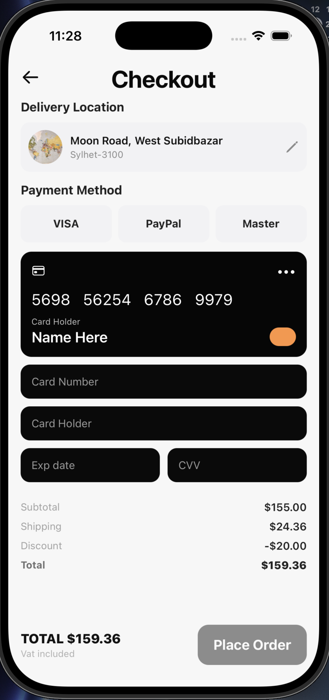
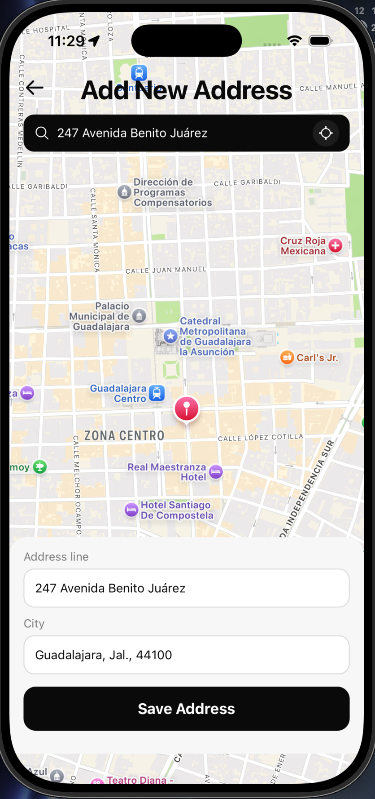
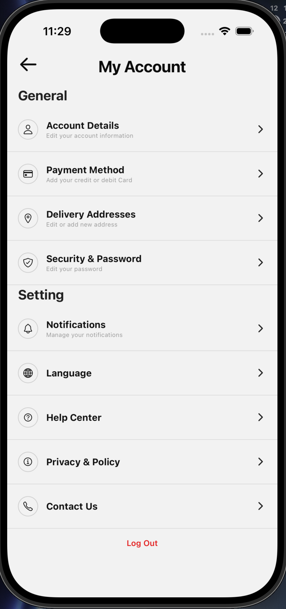

# E-CommerceStore App

Aplicacion mobile de e-commerce construida con **React Native + Expo**, con flujo completo de compra y modulo de cuenta de usuario.

## Vista General

E-CommerceStore incluye:

- Onboarding y autenticacion (Login / Sign Up)
- Catalogo por categorias y busqueda
- Producto detalle
- Wishlist (favoritos)
- Bag (carrito)
- Checkout
- Direcciones con mapa y ubicacion
- Flujo de orden exitosa
- Modulo completo de **My Account** con subpantallas de configuracion

## Galeria Visual (Portfolio)

Esta galeria esta preparada para mostrar las vistas principales de la app con un formato tipo portafolio.

### Vistas principales

| Onboarding | Login |
| --- | --- |
|  |  |

| Home | Categories |
| --- | --- |
|  |  |

| Product Detail | Wishlist |
| --- | --- |
|  |  |

| Bag | Checkout |
| --- | --- |
|  |  |

| Add Address | My Account |
| --- | --- |
|  |  |

### Como agregar tus vistas

1. Copia cada imagen a la carpeta docs/screenshots.
2. Usa exactamente estos nombres de archivo para que la galeria funcione sin editar el README:

- home.png
- categories.png
- product-details.png
- wishlist.png
- bag.png
- checkout.png
- add-address.png
- my-account.png
- onboarding.png
- login.png

3. Haz commit y push para que la galeria se vea en GitHub.

## Stack Y Herramientas

### Core

- **Expo SDK**: `~55.0.5`
- **React**: `19.2.0`
- **React Native**: `0.83.2`

### Librerias principales

- `react-native-maps` para mapa de direcciones
- `expo-location` para geolocalizacion
- `@react-native-community/slider`
- `expo-linear-gradient`
- `expo-status-bar`

### Entorno recomendado

- Node.js LTS
- Xcode (para iOS)
- Android Studio (para Android)
- Expo CLI via `npx expo`

## Estructura Del Proyecto

```text
E-CommerceStore/
├── App.js
├── app.json
├── index.js
├── package.json
├── assets/
├── ios/
└── src/
    ├── components/
    └── data/
```

## Flujo Principal De Pantallas

1. Onboarding
2. Login / Sign Up
3. Home (catalogo)
4. Product Detail
5. Wishlist / Bag
6. Checkout
7. Add Address (map + location)
8. Order Success
9. My Account + subpantallas (details, payment, addresses, password, notifications, language, help, terms, contact)

## Instalacion

1. Clona el repositorio.
2. Entra al proyecto.
3. Instala dependencias:

```bash
npm install
```

## Ejecucion

### Desarrollo general

```bash
npm run start
```

### iOS (nativo)

```bash
npm run ios
```

Si necesitas recompilar el binario nativo limpio:

```bash
npx expo run:ios --no-build-cache
```

### Android (nativo)

```bash
npm run android
```

### Web

```bash
npm run web
```

## Configuracion De Permisos (iOS)

Este proyecto ya incluye en `app.json`:

- `NSLocationWhenInUseUsageDescription`
- `NSLocationAlwaysAndWhenInUseUsageDescription`

Para aplicar cambios nativos de forma segura en iOS, usa recompilacion:

```bash
npx expo run:ios --no-build-cache
```

## Scripts Disponibles

```json
{
  "start": "expo start",
  "android": "expo run:android",
  "ios": "expo run:ios",
  "web": "expo start --web"
}
```

## Troubleshooting Rapido

- Si no ves cambios de UI: reinicia bundler y recompila iOS con `--no-build-cache`.
- Si falla mapa/ubicacion: valida permisos en `app.json` y recompila app nativa.
- Si hay conflicto de dependencias: elimina `node_modules` y ejecuta `npm install`.

## Capturas Adicionales Opcionales

Si deseas ampliar la galeria, puedes agregar tambien:

- order-success.png
- account-details.png
- payment-method.png
- delivery-address.png
- notifications.png

## Autor

Proyecto desarrollado y refinado para flujo completo de tienda mobile en React Native/Expo.
